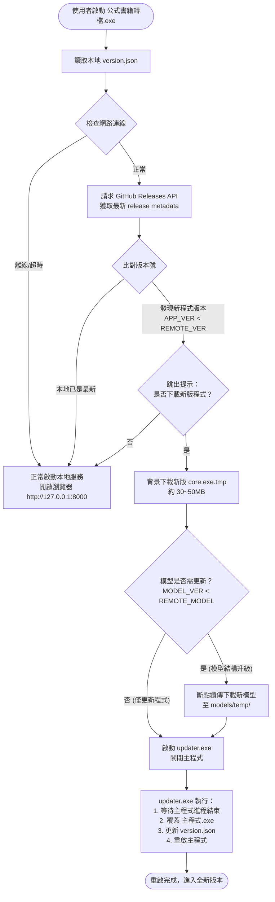

# 🚀 專案發布與自動更新任務架構規劃 (TASK.md)
> 本文件規範「公式書籍轉檔與 AI 公式萃取系統」之獨立 EXE 打包、模型獨立外置、版本分流管理與 GitHub Releases 自動更新流程。

---

## 🎯 設計目標與核心痛點

1. **體積痛點**：AI 深度學習模型權重檔（如 `yolo_v8_ft.pt` 約 350 MB）體積極大，若直接包進單一 EXE，任何一行程式碼修正（Hotfix）都會導致使用者必須重新下載 400 MB 以上的安裝檔。
2. **網路與權益限制**：GitHub Releases 單檔上限雖然支援較大檔案，但使用者頻繁下載大檔體驗極差，且 Git 倉庫絕對嚴禁提交超過 100 MB 的權重檔。
3. **分流解法**：
   - **程式本體 EXE（動態輕量）**：僅含 Python 執行環境、FastAPI/UI 與業務邏輯，壓縮後約 30~50 MB。
   - **AI 模型目錄（靜態外置）**：存放在執行檔同級目錄之 `models/` 或 `config/` 中，僅在「模型架構升級」時才需更新。
   - **獨立版本號**：採用 `APP_VERSION`（如 `v1.2.0`）與 `MODEL_VERSION`（如 `m1.0.0`）分軌管理。

---

## 🏗️ 目錄架構標準 (Onedir / 綠色便攜免安裝)

發布至終端使用者的資料夾結構：

```text
公式書籍轉檔/
├── 公式書籍轉檔.exe         # 程式本體（每次發布更新此檔）
├── updater.exe             # 獨立熱更新輔助程式（或 updater.bat）
├── version.json            # 本地版本元數據 (app & model)
├── models/                 # 模型獨立存放目錄 (不隨一般程式更新而重抓)
│   └── yolo_v8_ft.pt       # 350MB 權重檔 (初次部署時下載一次)
├── config/                 # 系統設定
│   └── settings.py / .env
└── web/                    # 前端靜態資源 (或已內嵌至 EXE)
    └── static/
```

---

## 🔄 雙軌更新生命週期流程圖 (Mermaid)



---

## 📋 實施階段原子任務清單 (Execution Milestones)

### 第一階段：版本元數據與外置模型路徑解耦
- [ ] **T1.1 定義 `version.json` 規範**：
  ```json
  {
    "app_version": "1.1.0",
    "model_version": "1.0.0",
    "model_hash": "sha256:xxxx",
    "min_compatible_model": "1.0.0"
  }
  ```
- [ ] **T1.2 改寫 `config/settings.py` 模型載入邏輯**：
  - 優先順序：`sys._MEIPASS` (若有) ➔ 當前執行目錄 `models/yolo_v8_ft.pt` ➔ `config/yolo_v8_ft.pt`。
  - 找不到模型時在 UI 顯示友善提示：「請先下載模型權重檔」，而非直接拋出崩潰。

### 第二階段：PyInstaller 打包規格配置 (`.spec`)
- [ ] **T2.1 建立 `build_app.spec`**：
  - 入口點指向 `scripts/run_web.py`。
  - 排除 350 MB 的 `config/yolo_v8_ft.pt`（透過 exclude 或不加入 datas）。
  - 將 `src/web/static` 加入打包資源。
  - 加入 Windows 原生圖示與 UTF-8 相容 manifest。
- [ ] **T2.2 撰寫一鍵編譯腳本 `scripts/build_exe.bat`**。

### 第三階段：輕量級熱更新輔助程式 (`updater.py` / `updater.bat`)
- [ ] **T3.1 解決 Windows 檔案鎖定問題 (File Lock)**：
  - Windows 不允許執行中的 EXE 覆寫自身。
  - 主程式下載新檔案至 `公式書籍轉檔.exe.new`。
  - 啟動 `updater.bat %PID%` 後，主程式立即 `sys.exit(0)`。
  - `updater.bat` 檢測進程結束後，執行 `move /y` 覆蓋並啟動新版。

### 第四階段：GitHub Actions CI/CD 自動發布流水線
- [ ] **T4.1 建立 `.github/workflows/release.yml`**：
  - 觸發條件：推送 tag（如 `git push origin v1.1.0`）。
  - 自動執行 PyInstaller 打包純程式 EXE。
  - 自動建立 GitHub Release 並上傳單一輕量 EXE。
  - 模型檔案作為獨立 Release 資產（或放置於 HuggingFace / 專用存儲）。
